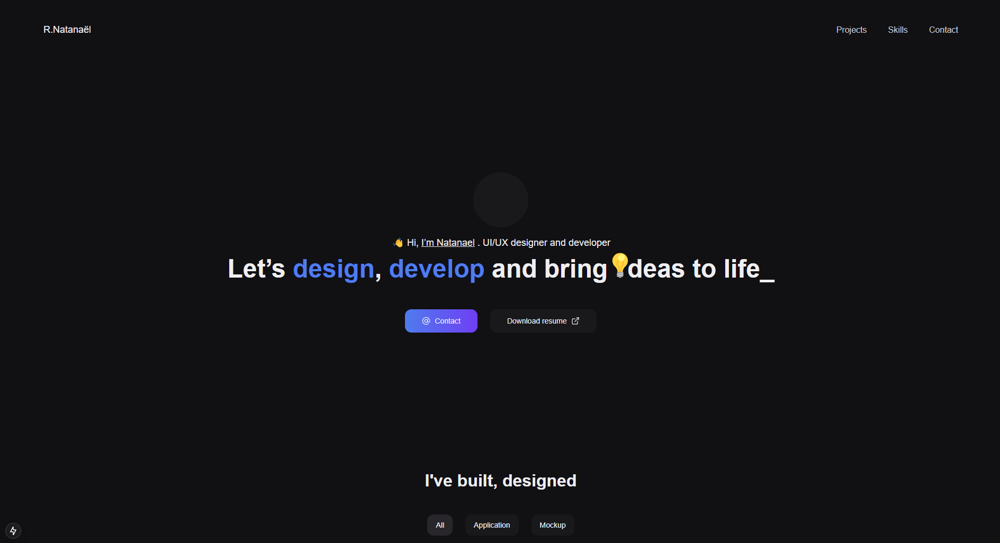

  

###

  

###

<h1 align="center">Hey there 👋, I'm Natanaël</h1>

###

<h3 align="center">I'm passionate about web development 🌐, mobile app creation 📱, and artificial intelligence (AI) 💡</h3>

###

- 📚 I'm currently learning React and Next js  - 👨‍💻 Some of my projects are available at https://nathanrael-portfolio.netlify.app  - 📫 How to reach me : 
  

  
  
  
    

 - 🤓Fun fact : I love creating stunning and user-friendly UIs that make a lasting impression! 👀

###

<h2 align="left">🛠 My skills</h2>

###

  
  
  
  
  
  
  
  
  
    
  

###

  
  
  
  
  
  
  

###

  
  
  
  
  

###

  
  
  
  
  
  
  

###

<h2 align="left">🔥  My Stats </h3>

###

  

  
  

###
